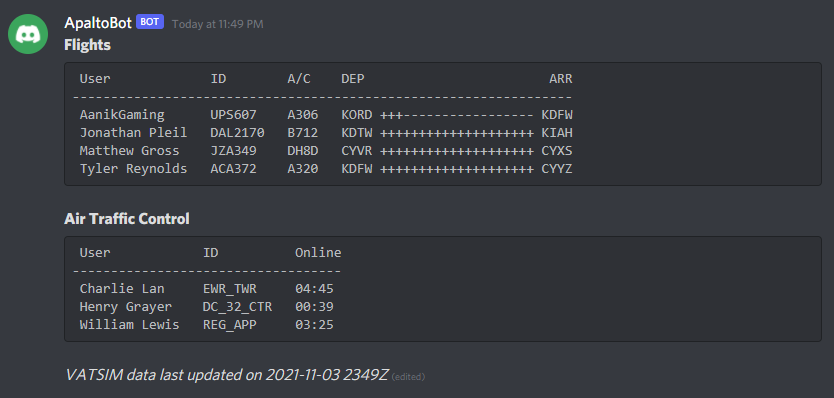

# ApaltoBot


ApaltoBot is a Discord bot that allows multiple Discord guilds to display a live listing of their members' VATSIM pilot and air traffic control activity.

## Discord Application

### Adding to a Guild
To join ApaltoBot to a Discord guild, go to the OAuth2 settings page for your Discord application, select the permissions specified below, and go to the generated URL to select a guild.

*Note: Your Discord user account must have `Manage Server` permissions to add a bot to a guild.*


### Configuring Discord Permissions
ApaltoBot requires the following permissions on the channel where VATSIM listings are to be displayed:

- View Channel
- Send Messages
- Manage Messages

## Setup

ApaltoBot can run natively or within a Docker container.

### Environment Variables
The following environment variables are required, either in a `.env` file created in the root directory, in `docker-compose.yml`, or set natively within your system:

- AVIATION_AIRPORTS_JSON_PATH
  - This is the path to the `airports.json` file, which lives in `./data` by default.
- DISCORD_ADMIN_ROLE_ID
  - This is an *optional* value specifying the snowflake of a Discord role. When specified, the `/addvatsim` and `/removevatsim` commands will be available to users with that role.
- DISCORD_APPLICATION_ID
  - This is the `Application ID` value of your Discord application.
- DISCORD_GUILDS_JSON_PATH
  - This is the path to the `discord-guilds.json` path, which lives in `./data` by default.
- DISCORD_PUBLIC_KEY
  - This is the `Public Key` value of your Discord application.
- DISCORD_TOKEN
  - This is the `Token` value of your Discord application's Bot.
- DISCORD_UPDATE_LISTING_INTERVAL
  - This value determines how the Discord message with VATSIM activity is updated, in milliseconds. `60000` is the recommended value.
- USERS_JSON_PATH
  - This is the directory path to where each Discord guild's JSON file for user data lives. A fully-qualified path to `./data/users` is the recommended value.
- USERS_SAVE_INTERVAL
  - This value determines how often updates are written to each Discord guild's JSON file for user data, in milliseconds. `15000` is the recommended value.
- VATSIM_DATA_URL
  - This value is the URL of VATSIM's data feed. `https://data.vatsim.net/v3/vatsim-data.json` is the recommended value.
- VATSIM_DATA_REFRESH_INTERVAL
  - This value determines how often updated data is downloaded from VATSIM's data feed, in milliseconds. `120000` is the recommended minimum value to comply with VATSIM's terms of service.

*Note: For ease-of-use and flexibility, it is recommended to define all settings in a `.env` file and then override only `AVIATION_AIRPORTS_JSON_PATH`, `DISCORD_GUILDS_JSON_PATH`, and `USERS_JSON_PATH` in `docker-compose.yml` with appropriate volumes set. This will enable you to run the application both in your local development environment and in a Docker container without having to maintain two sets of environment variables.*

The following is a sample `.env` file which can be used as a template:

```env
AVIATION_AIRPORTS_JSON_PATH=C:\Projects\apaltobot\data\airports.json
DISCORD_APPLICATION_ID=
DISCORD_GUILDS_JSON_PATH=C:\Projects\apaltobot\data\discord-guilds.json
DISCORD_PUBLIC_KEY=
DISCORD_TOKEN=
DISCORD_UPDATE_LISTING_INTERVAL=60000
USERS_JSON_PATH=C:\Projects\apaltobot\data\users
USERS_SAVE_INTERVAL=15000
VATSIM_DATA_URL=https://data.vatsim.net/v3/vatsim-data.json
VATSIM_DATA_REFRESH_INTERVAL=120000
```

### Discord Guild Configuration
The Discord guilds configuration file specified by the `DISCORD_GUILDS_JSON_PATH` setting should be in the following format:

```json
[
    {
        "name": "Discord Guild Name",
        "guildId": "000000000000000",
        "channelId": "000000000000000",
        "adminRoleId": "000000000000000",
        "displayFlights": true,
        "displayControllers": true
    }
]
```

All properties are required except for `adminRoleId`, which is optional. For more information, see the [Environment Variables](environment-variables) section.

*Note: The `name` property will be used to generate the file name for JSON file container user data.*

### Running the Application
#### Local Environment
To run the application in your local development environment, please follow these steps in a command prompt:

1. Execute `npm install`.
2. Execute `npm run start`.

#### Docker
To run the application in a Docker container, simply execute `docker-compose up` in a command prompt. The following is a sample `docker-compose.yml` file:

```yml
version: '3.9'
services:     
  apaltobot:
    container_name: 'apaltobot'
    build:
      context: .
    image: apaltobot
    volumes:
      - './data:/data'
    env_file:
      - .env
    environment:
      - AVIATION_AIRPORTS_JSON_PATH=/data/airports.json
      - DISCORD_GUILDS_JSON_PATH=/data/discord-guilds.json
      - USERS_JSON_PATH=/data/users
```

## Discord Commands

ApaltoBot adds several [Application Commands](https://discord.com/developers/docs/interactions/application-commands) to each linked Discord guild.

### Link a VATSIM Account

`/linkvatsim` allows users to associate a VATSIM account to their Discord account. A `cid` parameter is required.

### Unlink a VATSIM Account

`/unlinkvatsim` allows users to remove their associated VATSIM account to be excluded from the activity listing.

### Add a VATSIM User

`/addvatsim` is an administrator-only command which allows users to add data for VATSIM users who may or may not be members of the Discord guild. This requires `cid` and `username parameters.

### Remove a VATSIM User

`/removevatsim` is an administrator-only command which allows users to remove any VATSIM user. A `cid` parameter is required.